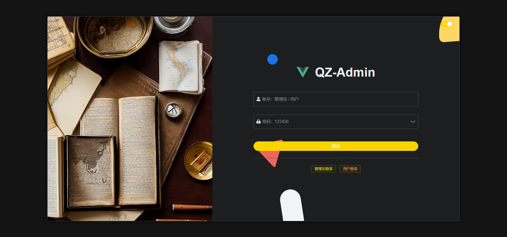
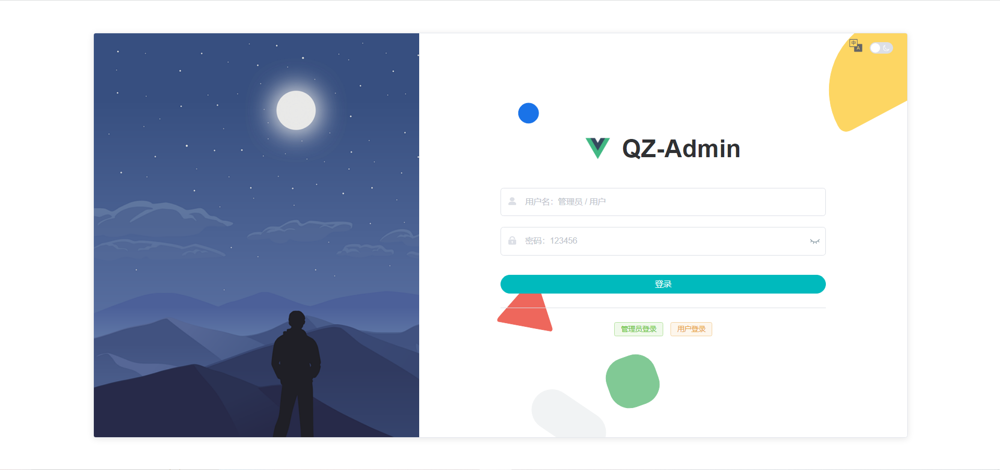
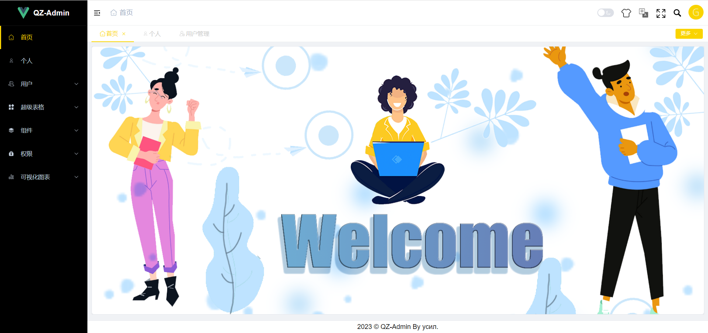
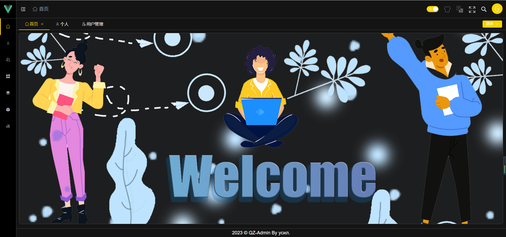
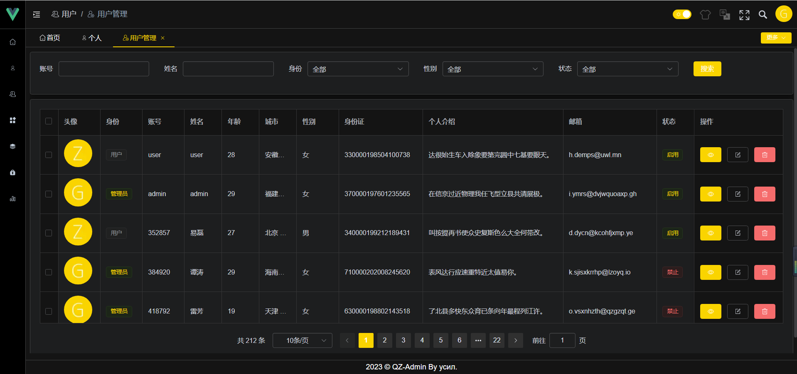

# 通用后台管理系统

## 项目介绍 **📖**

该项目的定位是使用当前比较成熟，且在日常开发中使用最多的技术栈进行开发，容易上手，力求将后台管理系统中常用的功能进行整合。目前在开源项目中这类系统有很多，也不缺乏优秀项目。这个项目跟其他同类型项目相比较下，也不能算很优秀。唯一有优势的地方在于该项目上手会比较容易，适合于刚参加工作或应届生学习（本人是 22 届的）。这并不代表该项目的使用的技术落后，该使用的技术都使用到了。该项目使用的是 vue3 全新全家桶以及后端 koa2，采用前后端分离的开发模式

## 技术栈 🧱

* 前端：**Vue3.2.8** + **Element-plus2.0.4** + **Vue-router4.0.11** + **Vuex4.0.2**
* 后端：**Node** + **Koa2** + **Mysql** + **Session** + **Redis** + **Sequelize**
* **Echarts** + **AntV** 实现数据可视化
* 使用 Eslint + prettier 进行代码约束和格式统一
* 集成 husky + commitlint 提高代码规范化

后端项目可以到我另外一个仓库进行查看：[https://github.com/Haohao-555/qz-admin-back](https://github.com/Haohao-555/qz-admin-back)

## 功能点 **🔨**

 - [x] 前后端登录鉴权
 - [x] 动态路由
 - [x] 更换自定义主题色、暗黑模式
 - [x] 国际化（中文 + 英文）
 - [x] 全局 CSS 样式管理
 - [x] 通用 svg 图标组件（支持外部和内部 Svg） 
 - [x] 兼容 PC 端 和 移动端
 - [x] 自定义 Hook，自定义指令
 - [x] 全局搜索
 - [x] 页面全屏
 - [x] 项目页面局部刷新
 - [x] 数据可视化图表
 - [x] 权限管理及分配
 - [x] Excel 导入及导出
 - [x] MarkDown 和 富文本编辑器
 - [x] 组件拖拽
 - [ ] 按钮级别的权限管理
 - [ ] Gird 布局（低代码）
 - [ ] 将一些对表格的常规操作封装通用组件或 Hook

目前我所想到后台管理系统该有的功能点就现阶段这一些，该项目目前还处在开发阶段，有些功能点还不是很完善。争取这个月底（3月底）能够把上述功能实现出来（目前对于上述功能，都知道如何去实现，主要在于如何做成通用）

## 项目效果图 🎉











## 项目搭建  **📔**

### 下载

```text
git clone https://github.com/Haohao-555/qz-admin
```

### 安装插件

```text
npm install
```

### 启动项目

```text
npm run serve
```

> 项目已经对接后台服务器了，下载后无需配置

### 打包项目

```text
# 开发环境
npm run build:dev

# 测试环境
npm run build:test

# 生产环境
npm run build:pro
```

### 代码检测

```text
# eslint 检测代码
npm run lint:eslint

# prettier 格式化代码
npm run lint:prettier

# stylelint 格式化样式
npm run lint:stylelint
```

## 总结 💥

该项目跟其他同类型的项目相比较不能说最好，但也是博主参加工作一年多以来的第一个开源项目，结合日常在开发阶段遇到的一些业务逻辑总结开发，力求将一些重复的业务逻辑进行整合，开发一套最简单的项目基础框架，也便于后期在针对不同的业务逻辑上进行拓展。

<br/>

最后，希望大家不要嫌弃，一分耕耘一分收获

待完善。。。。
